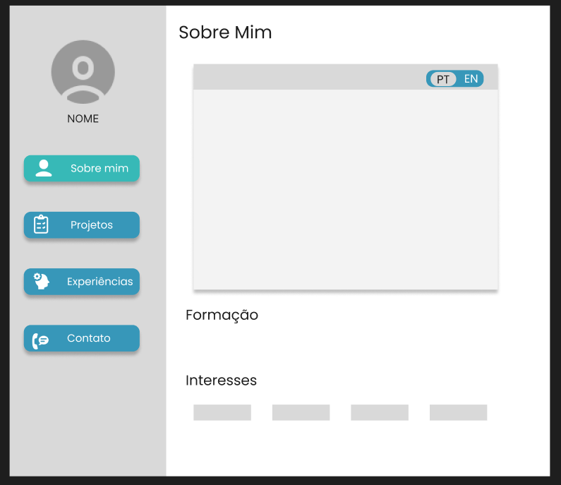

# Portfólio Profissional com Arquitetura e Controle de Acesso (RBAC)

Website de portfólio profissional responsivo desenvolvido para a disciplina de **Laboratório de Desenvolvimento de Software** da **PUC Minas**. 

O projeto conta com um **frontend estático (HTML/CSS/JS Vanilla)** integrado a um **backend Node.js/Express** alimentado por **Supabase** (PostgreSQL e Auth) e **Resend** (disparo de e-mails), implementando um sistema completo de **Controle de Acesso Baseado em Papéis (RBAC - Role-Based Access Control)**, **Telemetria de Acessos** e **Internacionalização (PT/EN)**.

---

## 👥 Integrantes

- Caio César Falinacio dos Santos
- Luiz Fernando Cunha Maia
- Pedro Henrique Nogueira Ferreira

---

## 🚀 Funcionalidades Principais

### 🔒 Controle de Acesso Baseado em Papéis (RBAC)
- **Visitante (`visitor`)**: Acesso público padrão sem autenticação. Renderiza a bio resumida, projetos públicos, histórico de experiências, lista de tecnologias/skills e links de contato. Inclui o botão *"Solicitar Acesso Especial"*.
- **Contratante (`contractor`)**: Acesso via token embarcado na URL (`?token=xyz`). Exibe dados voltados para recrutadores (download do CV completo em PDF, pretensão salarial, contato direto via WhatsApp/e-mail e histórico profissional detalhado).
- **Parceiro (`partner`)**: Acesso via token embarcado na URL (`?token=xyz`). Exibe visualização voltada a colaboradores técnicos (repositórios privados selecionados, propostas de projetos e termos de parceria).
- **Admin (`admin`)**: Painel administrativo restrito (`admin.html`) autenticado via Supabase Auth. Permite gerar/revogar tokens de acesso, enviar convites por e-mail, visualizar solicitações de acesso e analisar dados de telemetria.

### 🔑 Autenticação Passiva & Solicitação de Acesso
- **Autenticação Passiva (RF02)**: Usuários especiais acessam através de links com token (`?token=...`), sem necessidade de criar cadastro.
- **Formulário de Acesso Especial (UC03)**: Visitantes podem solicitar acesso preenchendo nome, organização, LinkedIn e finalidade. Ao enviar, o backend notifica o proprietário via e-mail (Resend Webhook) e registra a solicitação no banco de dados.

### 📊 Telemetria e Registros (RF04)
- Registro automático de visualizações de página, cliques em links de contato e downloads de documentos (PDF), vinculados ao token e papel do usuário.
- Painel de telemetria e gráficos agregados no dashboard do administrador.

### 🌐 Internacionalização (PT / EN)
- Alternância dinâmica de idiomas (Português e Inglês) via dicionário em JavaScript, alterando textos da navegação, hero, projetos, experiências, contatos e modais.

---

## 🛠️ Tecnologias Utilizadas

### Frontend
- **HTML5 & CSS3** (Design responsivo, variáveis CSS, layout flexbox/grid e modais)
- **JavaScript (Vanilla ES6+)** (Manipulação de DOM, fetch API, internacionalização e controle RBAC)
- **Lucide Icons** (Ícones modernos)
- **Supabase JS SDK** (Autenticação do admin)

### Backend (`portfolio-api/`)
- **Node.js & Express** (API REST em TypeScript)
- **Supabase (PostgreSQL + Auth)** (Persistência de dados, tokens, logs e autenticação admin)
- **Resend API** (Serviço de envio de e-mails/webhooks)
- **Express Rate Limit & CORS** (Segurança e proteção contra abusos)

---

## 📁 Estrutura do Projeto

```text
portfolio-profissional/              # Repositório Frontend
├── assets/
│   ├── css/
│   │   ├── style.css                # Estilos globais, layout e RBAC
│   │   └── admin.css                # Estilos do painel administrativo
│   ├── images/                      # Imagens de perfil e capturas
│   └── js/
│       ├── main.js                  # Lógica principal e dicionário PT/EN
│       ├── rbac.js                  # Validação de token, renderização por papel e telemetria
│       └── admin.js                 # Lógica do painel de administração (Supabase Auth & API)
├── index.html                       # Página principal do portfólio
├── admin.html                       # Painel administrativo
└── README.md                        # Documentação do projeto

portfolio-api/                       # Repositório Backend API
├── database/
│   └── migration.sql                # Script de criação das tabelas no Supabase (PostgreSQL)
├── src/
│   ├── index.ts                     # Servidor principal Express
│   ├── lib/
│   │   ├── supabase.ts              # Cliente Supabase (Service Role)
│   │   ├── telemetry.ts             # Serviço de registro de logs
│   │   └── webhook.ts               # Serviço de envio de e-mails via Resend
│   ├── middleware/
│   │   └── authAdmin.ts             # Middleware de proteção JWT do Supabase Auth
│   └── routes/
│       ├── validateToken.ts         # Endpoint POST /api/validate-token
│       ├── requestAccess.ts         # Endpoint POST /api/request-access
│       ├── telemetry.ts             # Endpoint POST /api/telemetry/log
│       └── admin/
│           ├── tokens.ts            # CRUD de tokens e envio por e-mail
│           ├── requests.ts          # Gestão de solicitações de acesso
│           └── logs.ts              # Logs de acesso e relatórios de telemetria
├── .env.example                     # Modelo de variáveis de ambiente
├── package.json
└── tsconfig.json
```

---

## ⚙️ Como Executar Localmente

### 1. Configurando o Backend (`portfolio-api`)

1. Navegue até o diretório `portfolio-api`:
   ```bash
   cd portfolio-api
   ```
2. Instale as dependências:
   ```bash
   npm install
   ```
3. Crie um arquivo `.env` baseado no `.env.example`:
   ```env
   SUPABASE_URL=https://seu-projeto.supabase.co
   SUPABASE_SERVICE_ROLE_KEY=sua_service_role_key
   RESEND_API_KEY=re_sua_chave_resend
   ADMIN_EMAIL=seu-email@exemplo.com
   FRONTEND_URL=http://localhost:5500
   PORT=3001
   ```
4. Execute as migrations SQL contidas em `database/migration.sql` no **SQL Editor** do Supabase Dashboard.
5. Inicie o servidor em modo de desenvolvimento:
   ```bash
   npm run dev
   ```
   A API estará rodando em `http://localhost:3001`.

### 2. Configurando o Frontend (`portfolio-profissional`)

1. Abra a pasta `portfolio-profissional` em seu editor de código.
2. Certifique-se de que a variável `API_URL` em `assets/js/rbac.js` e `assets/js/admin.js` aponte para a URL do seu backend local (`http://localhost:3001`) ou de produção.
3. Abra o arquivo `index.html` utilizando o **Live Server** ou qualquer servidor HTTP estático.
4. Para acessar o painel de administração, navegue para `admin.html`.

---

## 📐 Wireframes Originais

<details>
<summary>Clique para visualizar os wireframes de planejamento inicial</summary>

### Visão Inicial / Hero


### Projetos


### Experiências


### Contato e Rodapé


</details>

---

© 2026 Caio César Falinacio dos Santos. Todos os direitos reservados. | **PUC Minas**